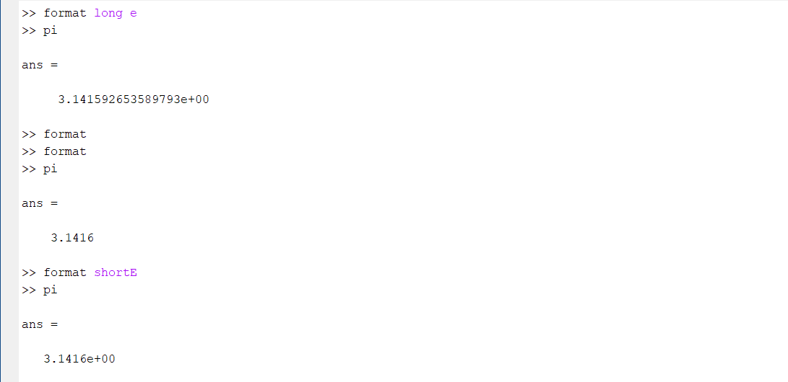
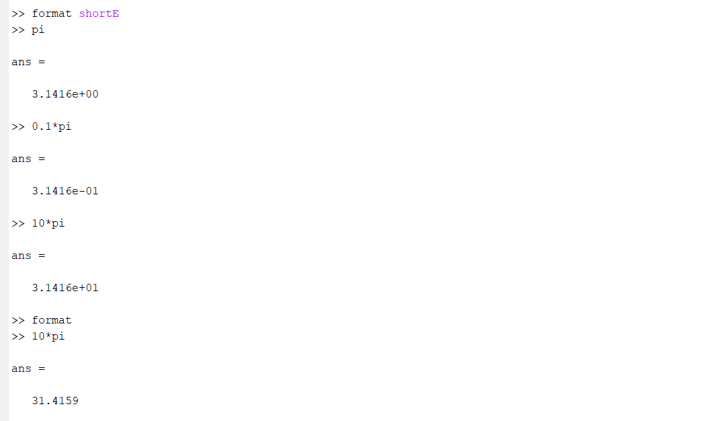
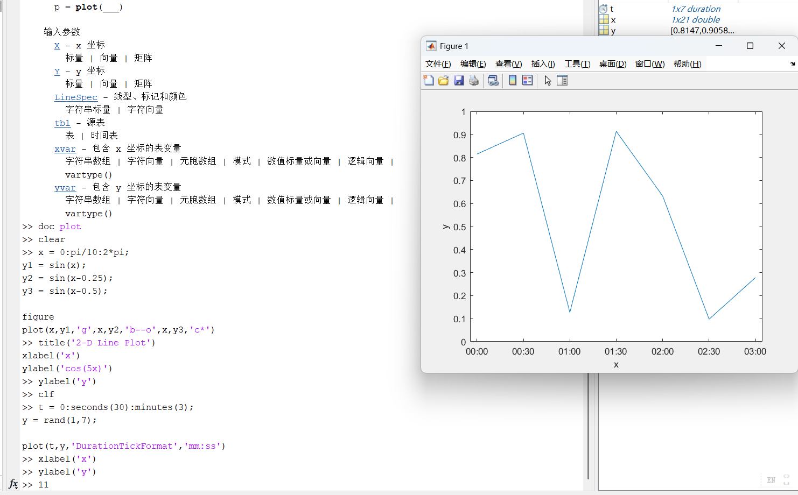
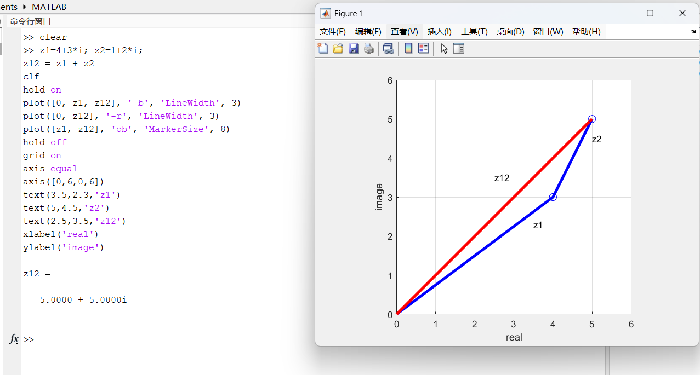

# MATLAB软件入门：全面知识点与考点总结

## 知识总览

### 新出现的符号/变量
- `pi`: 圆周率
- `i`, `j`: 虚数单位
- `eps`: 浮点相对精度
- `inf`: 无穷大
- `NaN`: 非数
- `ans`: 默认计算结果变量

### 定义/概念
- 变量命名规则
- MATLAB搜索路径
- 矩阵运算 vs 数组运算 (Matrix vs Array operations)
- 复数表示 (Complex number representation)

### MATLAB内置函数
- **基本命令**: `clear`, `clc`, `clf`, `format`, `help`, `doc`, `who`, `whos`, `cd`, `dir`, `type`
- **数学函数**: `sin`, `cos`, `exp`, `real`, `imag`, `abs`, `angle`, `roots`, `nthroot`, `jordan`
- **向量/矩阵生成**: `linspace`, `logspace`, `zeros`, `ones`, `eye`
- **绘图**: `plot`, `axis`, `xlabel`, `ylabel`, `grid`, `text`, `legend`, `title`

## 一、课程介绍与学习指南[^1]

**⭐⭐⭐ 关键信息**：

- **学分与课时**：3学分，每周理论课+双周实验课
- **成绩构成**：平时成绩40%（作业12次，课堂互动加分），期末考试60%
- **课程难度**：作业难度中上，有选做题可加分，期末卷子难度不低
- **学习秘诀**：结合课本多看课件，多上机测试，结合实际需要进行查询思考拓展

**🎯 备考策略**：

1. **作业重视度高**：12次作业占平时成绩大头，务必认真完成
2. **上机练习**：MATLAB是实践型课程，多动手才能掌握
3. **期末考试**：难度不低，需要理解概念+熟练操作
4. **加分机会**：选做题、课堂互动可提分，不要错过

## 二、编程语言与数学软件的比较[^1]

### C/C++编程语言特点

**优点**：

- 编码规范性强，功能"无所不能"
- 运行效率极高，速度快，内存占用少

**缺点**：

- 所有功能需"从零开始"，编程工作量大
- 对编程基础要求高
- 短时间难以完成复杂功能

**最佳用途**：成为编程达人的启蒙语言

### Python语言特点

**优点**：

- 功能较为丰富，语言结构规范
- 在深度学习、神经网络研究中有优势
- 代码包体系完整

**缺点**：

- 代码编辑界面混乱简陋
- 扩充包普遍零散，代码准确性不稳定
- 时间和空间复杂度不稳定，运行速度普遍慢于MATLAB

### MATLAB特点

**优点**：

- **应用率最高**：自21世纪以来，在应用数学和数据科学领域使用率最高
- 更加友好的编程方式
- 更广泛的应用功能
- 更强的编码拓展性
- 特长领域：数值运算、矩阵运算、数据分析、数据处理

### 编程语言排行（2025年7月）[^1]

| 排名 | 语言   | 占比   | 变化    |
| :--- | :----- | :----- | :------ |
| 1    | Python | 26.98% | +10.85% |
| 2    | C++    | 9.80%  | -0.53%  |
| 3    | C      | 9.65%  | +0.16%  |
| 4    | Java   | 8.76%  | +0.17%  |
| 5    | C\#    | 4.87%  | -1.85%  |
| 17   | MATLAB | 1.11%  | -0.23%  |

## 三、MATLAB基本特性[^1]

**⭐⭐⭐ 语言特性（考点）**：

- **解释性程序语言**：无需编译，大都按行逐句解释运行，直到发生错误或中断
- 类似于Python和Basic语言

**功能特性**：

- 高效的数值计算及符号计算功能
- 丰富的应用工具箱，具有官方可靠的实现
- 完备的图形处理功能，实现可视化
- 友好的用户界面，接近数学表达式的自然化语言

**⭐⭐⭐ 性能注意（重点考点）**：

- 解释性语言导致循环（特别是多层循环）运行时间极慢
- **关键优化策略**：代码中应尽量进行**"向量化操作"**

**💡 考试提示**：

1. **向量化 vs 循环**：考试可能要求比较两种方法的效率
2. **解释性语言**：理解为什么循环慢（逐行解释执行的开销）
3. **实际应用**：能够将循环代码改写为向量化形式

## 四、MATLAB软件安装与配置[^1]

### 安装步骤

1. 登录或创建MathWorks账户
2. **必须使用中大邮箱**（@mail.sysu.edu.cn）进行验证
3. 登录MathWorks账户后点击下载按钮
4. 可选择安装版本

### 安装建议

- 最新版本需要数十GB硬盘空间
- 若硬盘空间紧张，可：
  - 安装旧版本
  - 进行部分安装（先安装主程序及常用工具箱，不安装Simulink、自动驾驶等）
  - 删除硬盘上不必要的文件

## 五、MATLAB界面与窗口[^1]

### 主要窗口组成

1. **命令窗口（Command Window）**
   - 输入MATLAB指令的地方
   - 显示计算结果和输出
2. **当前文件夹窗口（Current Folder）**
   - 显示当前工作目录下的文件
   - 可浏览和管理文件
   - 支持新建、打开、删除等操作
3. **工作区窗口（Workspace）**
   - 显示已定义的所有变量
   - 显示变量的名称、值和数据类型
   - 可双击矩阵查看和编辑其元素
4. **M文件编辑器（M-file Editor）**
   - 编写和编辑MATLAB脚本程序
   - 支持代码编写、保存、运行和调试
5. **历史命令窗（History Window）**
   - 显示最近执行过的所有命令
   - 可快速调用和修改历史命令
6. **帮助浏览器（Help Browser）**
   - 查看MATLAB帮助文档
   - 搜索函数和功能说明

### 界面版本差异

- **R2012a版本**：较旧界面设计
- **R2016b版本**：中间版本
- **R2019a及以后**：新界面设计（HOME、PLOTS、APPS等选项卡）

## 六、MATLAB运算基础[^1]

### 基本数学运算[^1]

```matlab
>> (12+2*sin(pi/6))/3.25^2
ans = 1.2308
```

**⭐⭐⭐ 运算优先级（必考）**：括号 → 乘方 → 乘除 → 加减（与数学相同）

**常用内置常量**：`pi`代表圆周率 $\pi$

**📌 重要细节**：

- `pi`是预定义常量，可以直接使用
- `sin()`函数的参数是**弧度**，不是角度
- `pi/6`表示30度角
- 运算符 `^`表示乘方，优先级高于乘除

### ⭐⭐⭐ 变量命名规则（必考）[^1]

1. **区分大小写**：A和a是不同的变量
2. **首字符要求**：必须为字母，不得为数字
3. **避免冲突**：不能与MATLAB关键词重复（for、if、else、end等）
4. **覆盖现象**：变量名与MATLAB自带变量名重复会覆盖原有取值

**❌ 常见错误示例**：

```matlab
>> pi=2          % 覆盖了内置的pi常量
pi = 2
>> 2*pi
ans = 4          % 现在pi=2，不再是3.14159！

>> clear pi      % 清除变量可恢复原值
>> 2*pi
ans = 6.2832     % 恢复正常
```

**🔑 考试重点**：

- **变量覆盖**：`pi`、`i`、`j`等可以被覆盖，使用 `clear`恢复
- **命名冲突**：不能用 `for`、`if`、`end`等关键词作为变量名
- **大小写敏感**：`Var`和 `var`是完全不同的变量

### 特殊数值与预定义变量[^1]

| 预定义变量         | 含义                  | 获取方式                                        |
| :----------------- | :-------------------- | :---------------------------------------------- |
| `pi`             | 圆周率                | 常数                                            |
| `i` 或 `j`     | 虚数单位$\sqrt{-1}$ | 常数                                            |
| `eps`            | 浮点数$2^{-52}$     | 最小浮点误差                                    |
| `inf` 或 `Inf` | 正无穷                | 如 1/0                                          |
| `nan` 或 `NaN` | 不是一个数            | 如 0/0, 0*inf, inf/inf                          |
| `realmax`        | 最大正实数            | $1.797693134862316 \times 10^{308}$（double） |
| `realmin`        | 最小正实数            | -                                               |
| `intmax`         | 最大正整数            | 如int64: 9223372036854775807                    |
| `intmin`         | 最小负整数            | -                                               |

**数据类型特化**：

- `realmax('double')` - 获取double类型最大值
- `realmax('single')` - 获取single类型最大值
- `intmax('int64')`、`intmax('int32')`、`intmax('int16')` - 获取各类型整数最大值

**🔍 详细说明**：

`intmax`函数针对不同整数类型的区别：

| 类型                | 位数 | 最大值                    | 返回类型  |
| :------------------ | :--- | :------------------------ | :-------- |
| `intmax('int16')` | 16位 | $2^{15}-1 = 32767$      | int16类型 |
| `intmax('int32')` | 32位 | $2^{31}-1 = 2147483647$ | int32类型 |
| `intmax('int64')` | 64位 | $2^{63}-1$              | int64类型 |

**💡 核心区别**：

**1. 所表示的整数类型不同**：

- `intmax('int16')` - 对应16位有符号整数类型int16，即2字节整数
- `intmax('int32')` - 对应32位有符号整数类型int32，即4字节整数
- `intmax('int64')` - 对应64位有符号整数类型int64，即8字节整数

**2. 最大可表示值范围不同**：

- 使用二进制补码表示有符号整数，最大值为$2^{n-1}-1$（n为位数）
- `int16`最大值：$2^{15}-1 = 32767$
- `int32`最大值：$2^{31}-1 = 2147483647$
- `int64`最大值：$2^{63}-1$（非常大的64位整数上界）

**3. 返回结果的类型不同**：

- `intmax('int16')`返回int16类型的标量，超出范围会饱和截断到此最大值
- `intmax('int32')`返回int32类型的最大整数，超出后转换会饱和到此值
- `intmax('int64')`返回int64类型的最大整数，行为同上但范围更大

**本质**：三者调用同一个 `intmax`函数，区别在于传入的整数类型不同，导致位宽、最大值、返回值类型都不同

### 续行输入法[^1]

当一行代码过长时，使用 `...`进行续行：

```matlab
>> S=1-1/2+1/3-1/4+...
1/5-1/6+1/7-1/8
S = 0.6345
```

## 七、MATLAB运算符与表达式[^1]

### ⭐⭐⭐ 算术运算符（必考重点）

**矩阵运算**（线性代数定义）：

- `+` - 矩阵加法
- `-` - 矩阵减法
- `*` - 矩阵乘法（线性代数运算）
- `\` - 矩阵左除：$A \backslash B = A^{-1} \times B$
- `/` - 矩阵右除：$A / B = A \times B^{-1}$
- `^` - 矩阵幂运算

**数组运算**（元素对元素）：

- `+` - 数组加法（同矩阵）
- `-` - 数组减法（同矩阵）
- `.*` - 数组乘法（对应元素相乘）⭐⭐⭐
- `.\` 或 `./` - 数组左除或右除 ⭐⭐
- `.^` - 数组幂运算 ⭐⭐⭐

**🔑 核心区别（必考）**：

| 运算 | 矩阵运算符    | 数组运算符      | 区别                                  |
| :--- | :------------ | :-------------- | :------------------------------------ |
| 乘法 | `*`         | `.*`          | `*`是线性代数乘法，`.*`是逐元素乘 |
| 除法 | `/`或 `\` | `./`或 `.\` | `/`是矩阵除法，`./`是逐元素除     |
| 幂   | `^`         | `.^`          | `^`是矩阵幂，`.^`是逐元素幂       |

**💡 记忆技巧**：**带点(.)的是数组运算**，对应元素操作；不带点的是矩阵运算，遵循线性代数定义

### 关系运算符

| 算符   | 名称     | 说明       |
| :----- | :------- | :--------- |
| `>`  | 大于     | 返回逻辑值 |
| `<`  | 小于     | -          |
| `>=` | 大于等于 | -          |
| `<=` | 小于等于 | -          |
| `==` | 等于     | -          |
| `~=` | 不等于   | -          |

### 逻辑运算符

| 算符    | 名称        | 功能     |
| :------ | :---------- | :------- |
| `&`   | 与（AND）   | 逻辑与   |
| `\|`   | 或（OR）    | 逻辑或   |
| `~`   | 非（NOT）   | 逻辑非   |
| `xor` | 异或（XOR） | 异或运算 |

### ⭐⭐⭐ 矩阵与数组乘法对比（高频考点）[^1]

```matlab
>> A=[1 1;1 1]; B=[1 0;0 1];
>> A*B    % 矩阵乘法（线性代数）
ans = 1  1
      1  1
>> A.*B   % 数组乘法（逐元素）
ans = 1  0
      0  1
```

**🔑 关键区别（考试重点）**：

- `A*B`：按照矩阵乘法规则计算

  - 第(1,1)元素 = A(1,1)×B(1,1) + A(1,2)×B(2,1) = 1×1 + 1×0 = 1
  - 第(1,2)元素 = A(1,1)×B(1,2) + A(1,2)×B(2,2) = 1×0 + 1×1 = 1
- `A.*B`：按照对应位置元素相乘

  - 第(1,1)元素 = A(1,1)×B(1,1) = 1×1 = 1
  - 第(1,2)元素 = A(1,2)×B(1,2) = 1×0 = 0

**📝 考试常见题型**：

1. **给定矩阵计算 `A*B`和 `A.*B`，说明区别**
2. **判断哪种运算符适用于特定场景**
3. **向量化代码中必须使用数组运算符**

**⚠️ 常见错误**：

```matlab
>> x = 0:0.1:1;
>> y = x^2;      % ❌ 错误：x是向量，不能用矩阵幂
Error: Incorrect dimensions for matrix multiplication.

>> y = x.^2;     % ✅ 正确：逐元素平方
y = 0  0.01  0.04  0.09  0.16  0.25  0.36  0.49  0.64  0.81  1.00
```

## 八、⭐⭐⭐ 复数运算（重点考点）[^1]

### 复数的表示与创建

```matlab
>> z1 = 4 + 3i        % 直接赋值，3与i间不要留空格
z1 = 4.0000 + 3.0000i
>> z2 = 1 + 2*i       % 或使用j代替i
>> z3 = 2*exp(i*pi/6) % 极坐标形式（欧拉公式）
```

**📌 代码解释**：

- **直角坐标形式**：`z = a + bi`，其中a是实部，b是虚部
- **极坐标形式**：`z = r*exp(i*θ)`，其中r是模，θ是幅角
- **欧拉公式**：$e^{i\theta} = \cos\theta + i\sin\theta$

**⚠️ 常见错误**：

```matlab
>> z = 3 + 2 i      % ❌ 错误：i前有空格会被识别为变量
>> z = 3 + 2i       % ✅ 正确：i紧贴系数
>> z = 3 + 2*i      % ✅ 正确：使用乘号更安全
```

### 复数的运算

```matlab
>> z = z1*z2/z3
z = 1.8840 + 5.2631i
```

### 复数的属性提取

| 函数                | 功能         | 示例                     |
| :------------------ | :----------- | :----------------------- |
| `real(z)`         | 实部         | real(z) = 1.8840         |
| `imag(z)`         | 虚部         | imag(z) = 5.2631         |
| `abs(z)`          | 模（幅值）   | abs(z) = 5.5902          |
| `angle(z)`        | 幅角（弧度） | angle(z) = 1.2271        |
| `angle(z)*180/pi` | 幅角（角度） | angle_z_degree = 70.3048 |

**注意**：`z'` 表示共轭转置，对于标量复数等同于共轭

### 复数的几何应用

复数可在复平面上表示，进行向量加法等几何运算：

```matlab
clf              % 清空图形窗
hold on          % "打开一张纸"
plot([0, z1, z1+z2], '-b', 'LineWidth', 3)  % 绘制向量
plot([0, z1+z2], '-r', 'LineWidth', 3)
hold off         % "一张纸画完了"
grid on          % 显示网格
axis equal       % 纵横比相同
axis([0,6,0,6])  % 设置坐标范围
```

## 九、常用通用指令[^1]

| 指令                 | 含义                             | 用途       |
| :------------------- | :------------------------------- | :--------- |
| `ans`              | 最新计算结果的默认变量名         | 自动赋值   |
| `edit`             | 打开M文件编辑器                  | 编辑代码   |
| `cd`               | 设置当前工作目录                 | 路径管理   |
| `exit` 或 `quit` | 关闭/退出MATLAB                  | 退出程序   |
| `clf`              | 清除图形窗                       | 清空图像   |
| `clc`              | 清除指令窗中显示内容             | 清空命令窗 |
| `clear`            | 清除MATLAB工作空间中保存的变量   | 清空变量   |
| `dir`              | 列出指定目录下的文件和子目录清单 | 文件管理   |
| `help`             | 在指令窗中显示帮助信息           | 查看帮助   |
| `doc`              | 在MATLAB浏览器中显示帮助信息     | 详细帮助   |
| `type`             | 显示指定M文件的内容              | 查看代码   |
| `which`            | 指出其后文件所在的目录           | 查找文件   |
| `diary`            | 把指令窗输入记录为文件           | 记录会话   |
| `more`             | 使其后的显示内容分页进行         | 分页显示   |
| `return`           | 返回到上层调用程序；结束键盘模式 | 程序控制   |
| `close all`        | 关闭所有的弹出窗口               | 窗口管理   |

## 十、指令窗编辑与快捷操作[^1]

### 命令行编辑

- **↑键**：调出最近执行的命令，可修改个别字符后重新执行
- **关键词快速搜索**：先键入部分关键词（如 `plot`），再多次按↑寻找对应历史命令

### 分号的作用

在MATLAB语句末尾添加分号（`;`）可以**抑制输出显示**：

```matlab
>> z1=4+3*i;z2=1+2*i;  % 加分号，不显示结果
>> z12 = z1 + z2       % 不加分号，显示结果
z12 = 5.0000 + 5.0000i
```

## 十一、数据格式设置[^1]

### Format命令

使用 `format`命令控制数值显示格式：

```matlab
>> format long e      % 十六位有效数字，科学计数法
>> format shortE      % 五位有效数字，科学计数法
>> format             % 恢复默认四位小数格式
```





## 十二、M文件编辑器[^1]

### M文件的创建与打开

- 通过左上角"新建"→"脚本"创建新M文件
- 通过"打开"打开已有M文件
- 在当前文件夹窗口双击M文件直接打开编辑器

### 代码编辑与运行

- **注释**：使用 `%`符号，%后的内容自动显示为绿色，不影响运行
- **运行代码**：按F5或点击运行按钮
- **语法检查**：运行前MATLAB会进行简单语法检查
- **错误处理**：运行过程中计算发生错误则立即终止并报错

### 代码调试

- **设置断点**：按F12或点击"断点"菜单设立断点
- **单步调试**：便于追踪代码执行过程

### 最佳实践

- 有用的代码尽量保存成文件
- 养成良好的代码保存习惯
- 脚本可通过编辑器直接运行，便捷高效

### 绘图代码示例[^1]

```matlab
% exm010310.m
t=0:pi/50:4*pi;
y=exp(-t/3).*sin(3*t);
plot(t, y, '-r', 'LineWidth', 2)
axis([0, 4*pi, -1, 1])
xlabel('t'), ylabel('y')
```



**绘图相关函数**：

- `plot(x, y, 'style')`：绘制二维线图
- `axis([xmin, xmax, ymin, ymax])`：设置坐标轴范围
- `xlabel('name')`、`ylabel('name')`：设置轴标签
- `grid on`：显示网格
- `axis equal`：设置纵横比相同
- `axis square`：设置为方形
- `text(x, y, 'label')`：在指定位置添加文本

## 十三、工作区（Workspace）窗口[^1]

### 功能介绍

- 显示所有已定义变量的名称、值和数据类型
- 双击任意矩阵可以查看或直接编辑其元素
- 支持绘图操作：选中多个变量后进入"绘图"（Plot）选项卡可自动生成相应图表

### 数据操作

- 可直接在工作区修改矩阵元素值
- 支持多种数据可视化操作

## 十四、MATLAB搜索路径[^1]

### 搜索路径原则

当输入一个变量或函数名 `cont`后，MATLAB按以下顺序查找：

1. **内存检查**：首先检查内存（工作区），观察 `cont`是否为变量
2. **内建检查**：若不是变量，检查 `cont`是否为内建函数或常量
3. **当前文件夹**：在当前文件夹检查是否有名为 `cont`的M文件，若有则运行对应M文件
4. **搜索路径**：在搜索路径的其他文件夹查找是否有对应的M文件
5. **报错**：如果都没有，则会报错

### 搜索路径设置

#### 方法一：Set Path（菜单方式）

通过菜单HOME → Set Path：

- 点击"添加文件夹..."添加单个文件夹
- 点击"添加并包含子文件夹..."添加文件夹及其所有子文件夹
- 使用"上移"、"下移"调整搜索优先级
- 点击"保存"保存设置

#### 方法二：命令方式

- 使用 `path`命令查看和修改搜索路径
- 使用 `addpath`命令添加路径（课下自查）

### 搜索路径优化

搜索路径中的顺序很重要，靠前的路径优先级高。可通过上下移动调整优先级。

## 十五、MATLAB帮助系统[^1]

### 帮助形式与特点

| 帮助形式                      | 特点                    | 用途                                 |
| :---------------------------- | :---------------------- | :----------------------------------- |
| **指令窗帮助**（help）  | 文本形式，最原始可信    | 快速查看基本信息，不适于系统阅读     |
| **导航系统帮助**（doc） | HTML形式，系统叙述      | 系统阅读和交叉查阅，最重要的帮助形式 |
| **Web网帮助**           | 包括PDF、视频、讨论组等 | 获取最新信息和社区支持               |

### 帮助命令使用

#### 1. 指令窗帮助（help命令）

```matlab
>> help svd
```

显示简易的文本形式帮助信息，包含函数简述和基本用法。

#### 2. 弹出窗口帮助（helpwin命令）

```matlab
>> helpwin svd
```

在弹出窗口中显示建议帮助信息，可更清晰地查看内容。

#### 3. 详细参考页（doc命令）

```matlab
>> doc svd
```

在MATLAB浏览器中打开详细的HTML格式帮助文档，包含：

- 函数语法（Syntax）
- 详细描述（Description）
- 使用示例（Examples）
- 输入输出参数说明（Input/Output Arguments）
- 相关函数（See Also）

#### 4. 帮助浏览器搜索

点击帮助按钮进入MATLAB帮助界面，右上角搜索框搜索函数名（如 `plot`）：

- 可获得多个搜索结果
- 可按产品类型筛选
- 点击结果可查看完整文档

#### 5. 命令行现场提示

当输入函数且没有用Ctrl+F1开启现场提示功能时：

- 按F1可直接打开对应帮助引用页面

### 帮助系统的优势

- MATLAB官方帮助最权威、最可信
- 包含大量示例代码
- 支持交叉引用和快速导航
- 涵盖所有内置函数和工具箱

## 十六、MATLAB预设与个性化（Preferences）[^1]

通过HOME菜单的"预设"选项可以进行个性化设置，具体内容课下自查。

## 十七、MATLAB基础实操技巧[^1]

### 线性代数相关

**关键函数**：

- `jordan` 函数：计算Jordan标准形，用于判断矩阵是否可对角化
  - 当所有Jordan块为1×1时，矩阵可对角化
  - 存在大于1×1的Jordan块时，矩阵不可对角化

**多项式相关**：

- `roots(p)` 函数：求多项式p的根
  - 多项式用系数向量表示，从最高次项系数开始
  - 例如：$p(r) = r^3 - a$，则 `p=[1, 0, 0, -a]`

**复数根的处理**：

- MATLAB可自动处理复数根
- 可用 `abs()`获取复根模长，用 `angle()`获取幅角

## 十八、课堂教学示例汇总[^1]

### 例1.2-1：基础计算

```matlab
>> (12+2*sin(pi/6))/3.25^2
ans = 1.2308
```

### 例1.2-3：特殊数值

```matlab
format long e
RMAd=realmax('double')
RMAd = 1.797693134862316e+308
IMA64=intmax('int64')
IMA64 = 9223372036854775807
```

### 例1.2-4：复数表示与运算

给定 $z_1 = 4+3i$，$z_2 = 1+2i$，$z_3 = 2e^{i\pi/6}$，计算 $z = \frac{z_1z_2}{z_3}$：

```matlab
z1 = 4 + 3i
z2 = 1 + 2*i
z3 = 2*exp(i*pi/6)
z = z1*z2/z3
real_z = real(z)
image_z = imag(z)
magnitude_z = abs(z)
angle_z_radian = angle(z)
angle_z_degree = angle(z)*180/pi
```

### 例1.2-5：复数向量加法的几何意义

```matlab
z1=4+3*i; z2=1+2*i;
z12 = z1 + z2
clf
hold on
plot([0, z1, z12], '-b', 'LineWidth', 3)
plot([0, z12], '-r', 'LineWidth', 3)
plot([z1, z12], 'ob', 'MarkerSize', 8)
hold off
grid on
axis equal
axis([0,6,0,6])
text(3.5,2.3,'z1')
text(5,4.5,'z2')
text(2.5,3.5,'z12')
xlabel('real')
ylabel('image')
```



### 例1.2-6：多项式根与复数

判断 $\sqrt[3]{-8}$ 是否只能得到-2：

```matlab
a = -8;
r_a = a^(1/3)      % 计算主根（负号视为180度幅角）
r_a = 1.0000 + 1.7321i
r_n = nthroot(a, 3) % 计算实根
r_n = -2

p = [1, 0, 0, -a];  % 多项式 p(r) = r³ - a
R = roots(p)        % 求所有根
R = [-2.0000 + 0.0000i; 1.0000 + 1.7321i; 1.0000 - 1.7321i]

MR = abs(R(1));     % 获取复根模
t = 0:pi/20:2*pi;
x = MR*sin(t);
y = MR*cos(t);
plot(x, y, 'b:'), grid on
hold on
plot(R(2), '.', 'MarkerSize', 30, 'Color', 'r')    % 实根
plot(R([1,3]), 'o', 'MarkerSize', 15, 'Color', 'b') % 复根
axis([-3,3,-3,3]), axis square
hold off
```


**代码解析**：

在MATLAB中，用一个"系数向量"就可以表示一元多项式；`roots(p)` 约定把这个向量当成多项式的系数序列来求根，所以 `p = [1,0,0,-a]` 就代表多项式 $r^3 - a$。

- `p = [1, 0, 0, -a]` 表示多项式 $1 \cdot r^3 + 0 \cdot r^2 + 0 \cdot r + (-a) = r^3 - a$
- 当 $a = -8$ 时，多项式为 $r^3 + 8 = 0$，即 $r^3 = -8$
- 该方程有三个复数根，它们在复平面上均匀分布在以原点为圆心、半径为2的圆上
- 三个根的幅角分别相差 $\frac{2\pi}{3} = 120°$


**关键知识点**：

- `a^(1/3)` 与 `nthroot(a, 3)` 的区别
- `roots()` 函数用法
- 多项式系数向量表示法
- 复数在极坐标中的表示和作图

## 十九、学习建议与知识总结[^1]

**关键学习方法**：

- 结合课本多看课件
- 多上机测试，亲手敲代码
- 结合实际学习、研究需要进行查询、思考、拓展
- 利用官方帮助系统深入学习各函数用法

**核心技能培养**：

1. 熟悉MATLAB界面的各个窗口及其功能
2. 掌握基本的变量定义和运算符使用
3. 理解矩阵与数组运算的区别
4. 学会使用帮助系统独立解决问题
5. 能够编写、运行、调试M文件脚本
6. 理解搜索路径的查找原则
7. 具备利用MATLAB解决数学问题的能力

## 二十、⭐⭐⭐ 考试重点总结

### 必考知识点速查表

| 考点类别             | 重要度 | 关键内容                                          | 易错点             |
| :------------------- | :----- | :------------------------------------------------ | :----------------- |
| **运算符区别** | ⭐⭐⭐ | `*` vs `.*`, `/` vs `./`, `^` vs `.^` | 混淆矩阵和数组运算 |
| **复数运算**   | ⭐⭐⭐ | `real()`, `imag()`, `abs()`, `angle()`    | 幅角单位（弧度）   |
| **预定义变量** | ⭐⭐   | `pi`, `i`, `j`, `eps`, `inf`, `NaN`   | 变量覆盖问题       |
| **变量命名**   | ⭐⭐   | 大小写敏感，不能以数字开头                        | 关键词冲突         |
| **帮助系统**   | ⭐⭐   | `help`, `doc`, `lookfor`                    | -                  |
| **格式控制**   | ⭐     | `format long`, `format short`                 | -                  |
| **分号作用**   | ⭐⭐⭐ | 抑制输出，矩阵换行                                | 忘记加分号         |

### 核心代码示例汇总

#### 1. 矩阵 vs 数组运算（⭐⭐⭐ 必考）

```matlab
% 定义两个2×2矩阵
A = [1 2; 3 4];
B = [5 6; 7 8];

% 矩阵乘法（线性代数）
C1 = A * B               % C1 = [19 22; 43 50]
% 计算过程：C1(1,1) = 1*5 + 2*7 = 19

% 数组乘法（逐元素）
C2 = A .* B              % C2 = [5 12; 21 32]
% 计算过程：C2(1,1) = 1*5 = 5

% ⚠️ 考试陷阱：向量化代码必须用数组运算
x = 0:0.1:1;
y = sin(x) .* x.^2;      % ✅ 正确：.*和.^
% y = sin(x) * x^2;      % ❌ 错误：维度不匹配
```

#### 2. 复数运算全流程（⭐⭐⭐ 必考）

```matlab
% 步骤1：创建复数
z1 = 4 + 3i;             % 直角坐标形式
z2 = 2*exp(i*pi/6);      % 极坐标形式

% 步骤2：提取属性
r = abs(z1);             % 模：r = 5
theta = angle(z1);       % 幅角（弧度）
theta_deg = theta*180/pi; % 转换为角度

% 步骤3：复数运算
z3 = z1 * z2;            % 乘法
z4 = z1 / z2;            % 除法
z5 = conj(z1);           % 共轭

% 步骤4：验证性质
check1 = z1 * conj(z1);  % 应等于 abs(z1)^2 = 25
check2 = exp(i*pi);      % 欧拉公式：e^(iπ) = -1
```

#### 3. 向量生成方法对比（⭐⭐ 常考）

```matlab
% 方法1：冒号操作符
v1 = 0:0.5:2;            % 从0到2，步长0.5
% v1 = [0  0.5  1.0  1.5  2.0]

% 方法2：linspace（指定点数）
v2 = linspace(0, 2, 5);  % 从0到2，共5个点
% v2 = [0  0.5  1.0  1.5  2.0]（结果相同）

% 方法3：logspace（对数间距）
v3 = logspace(0, 2, 3);  % 10^0到10^2，3个点
% v3 = [1  10  100]

% 🔑 区别：
% - 冒号：指定步长
% - linspace：指定点数（更常用于绘图）
% - logspace：对数尺度（用于频率分析）
```

### 常见错误与解决方案

#### 错误1：矩阵和数组运算符混淆

```matlab
% ❌ 错误示范
x = [1 2 3];
y = x^2;                 % Error: 非方阵不能用矩阵幂

% ✅ 正确做法
y = x.^2;                % y = [1 4 9]（逐元素平方）
```

#### 错误2：复数定义时有空格

```matlab
% ❌ 错误示范
z = 3 + 2 i;             % i可能被识别为变量

% ✅ 正确做法
z = 3 + 2i;              % 或 z = 3 + 2*i（更保险）
```

#### 错误3：覆盖预定义变量

```matlab
% ❌ 危险操作
pi = 3;                  % 覆盖了圆周率！
i = 5;                   % 覆盖了虚数单位！

% ✅ 恢复方法
clear pi i               % 清除变量，恢复预定义值
```

### 快速记忆口诀

1. **运算符**：**带点是数组，不带点是矩阵**
2. **分号**：**抑制输出，矩阵换行**
3. **帮助**：**`help`看简介，`doc`看详解**
4. **复数**：**`a+bi`写在一起，`i`别留空**
5. **路径**：**先内存，后内建，再当前，最后搜索路径**

### 考前冲刺检查清单

- [ ] 能够区分 `*`和 `.*`，`/`和 `./`，`^`和 `.^`
- [ ] 熟练使用 `real()`, `imag()`, `abs()`, `angle()`处理复数
- [ ] 理解 `pi`, `i`, `j`, `eps`, `inf`, `NaN`的含义
- [ ] 掌握三种向量生成方法：`:`、`linspace`、`logspace`
- [ ] 会使用 `help`和 `doc`查询函数
- [ ] 理解搜索路径的查找顺序
- [ ] 知道分号的两个作用：抑制输出、矩阵换行
- [ ] 能够编写和运行简单的M文件
- [ ] 理解 `format`命令改变显示格式
- [ ] 掌握基本绘图命令 `plot()`, `xlabel()`, `ylabel()`

<div align="center">⁂</div>

[^1]: Di-Yi-Ke-MATLABRuan-Jian-Ru-Men-20250907.pdf
