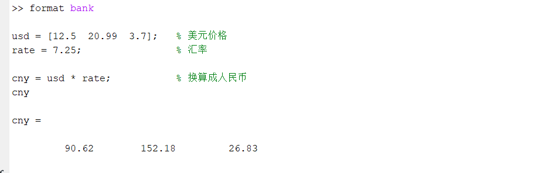
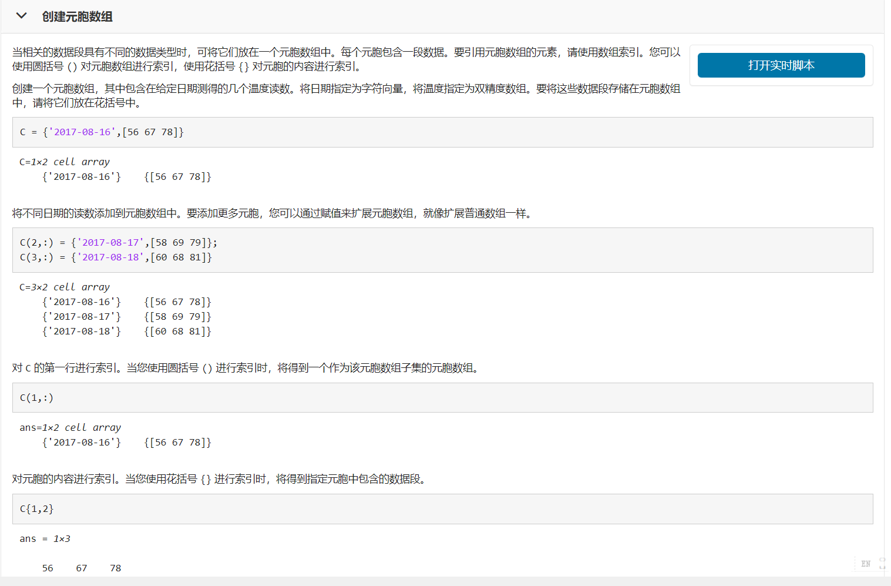

# MATLAB基础运算与符号计算（一）：全面知识点与考点总结

## 知识总览

### 新出现的符号/变量
- `sym`: 符号变量类型

### 定义/概念
- 符号计算 vs 数值计算
- 浮点数精度问题
- 符号表达式 (Symbolic Expressions)
- 符号函数 (Symbolic Functions)
- 自由变量 (Free Variables)
- 极限 (Limit), 导数 (Derivative), 积分 (Integral)
- 泰勒展开 (Taylor Expansion)
- 雅可比矩阵 (Jacobian Matrix)

### MATLAB内置函数
- **符号定义**: `sym`, `syms`
- **微积分**: `limit`, `diff`, `int`, `symsum`, `taylor`
- **线性代数**: `jacobian`, `det`
- **精度控制**: `vpa`, `digits`
- **辅助函数**: `solve`, `class`, `isAlways`, `disp`, `num2str`, `int2str`
- **绘图**: `fplot`

## 一、MATLAB作为计算器的精度问题[^1]

### 浮点数运算的特点

在MATLAB中进行浮点数运算时，可能出现与直觉不符的结果：

```matlab
% 演示浮点数运算的精度问题
>> a = 1/3
a = 0.3333

>> b = a*3
b = 1

% 为什么 b 不是 0.9999？
% 原因：MATLAB使用双精度浮点数进行运算
% 1/3 被存储为特定的二进制表示，乘以3后由于浮点数运算的精确性得到精确的1
```

**关键概念**：浮点数在计算机中的表示方式导致某些精度差异，但在特定情况下（如1/3×3=1）可能得到精确结果。

## 二、运算结果的显示形式[^1]

### Format命令详解

使用 `format`命令控制数值在命令窗口中的显示方式：

| 命令               | 含义                   | 说明                                        |
| :----------------- | :--------------------- | :------------------------------------------ |
| `format`         | 默认格式               | 一般保留4位小数，很大很小的数使用科学计数法 |
| `format long`    | 15位小数               | 显示更高精度                                |
| `format shortE`  | 5位有效数字科学计数法  | 短科学计数法                                |
| `format longE`   | 16位有效数字科学计数法 | 长科学计数法                                |
| `format rat`     | 有理数（分数）显示     | 将小数转换为分数表示                        |
| `format bank`    | 元、角、分表示         | 用于金融计算                                |
| `format compact` | 命令结果无空行         | 紧凑显示                                    |
| `format loose`   | 命令结果有空行         | 宽松显示（默认）                            |



### Format命令示例

```matlab
% 演示不同format命令的效果
>> format long
>> pi
ans = 3.141592653589793

>> format shortE
>> pi
ans = 3.1416e+00

>> format rat
>> pi
ans = 355/113          % 近似为分数

>> format            % 恢复默认
>> pi
ans = 3.1416
```

## 三、标点符号的功能与用法[^1]

### 详细标点符号表

| 名称               | 标点    | 作用                                                                 | 示例                                         |
| :----------------- | :------ | :------------------------------------------------------------------- | :------------------------------------------- |
| **空格**     |         | 命令与变量分隔符；矩阵同行元素间分隔符                               | `A = [1 2 3]`                              |
| **逗号**     | `,`   | 多条命令分隔（前面命令显示结果）；函数调用参数分隔；矩阵同行元素分隔 | `A = [1,2,3]; B = sin(x,y)`                |
| **黑点**     | `.`   | 小数点；组合构成数组运算符号；调用类和对象专属函数                   | `0.5`, `.*`, `.^`, `object.method()` |
| **分号**     | `;`   | 命令结束（不显示结果）；矩阵换行标志                                 | `A = [1,2;3,4]`                            |
| **冒号**     | `:`   | 生成一维数组（行向量）；寻址时单独使用表示"全部"                     | `1:10`, `A(:,1)`                         |
| **百分号**   | `%`   | 注释符号，%后添加注释内容                                            | `% 这是注释`                               |
| **单引号**   | `'`   | 矩阵的共轭转置                                                       | `A'`                                       |
| **单引号对** | `''`  | 包含字符串                                                           | `'hello'`                                  |
| **圆括号**   | `()`  | 改变运算次序；数组或矩阵援引；函数输入参数列表                       | `(a+b)*c`, `A(1,2)`, `sin(x)`          |
| **方括号**   | `[]`  | 表示输入数组或矩阵；函数输出参数列表                                 | `[1,2,3]`, `[a,b] = func()`              |
| **花括号**   | `{}`  | 胞元数组符号                                                         | `C = {1, 'a'; 2, 'b'}`                     |
| **赋值号**   | `=`   | 右边的计算结果赋值给左边变量                                         | `x = 5`                                    |
| **双等号**   | `==`  | 条件运算表达式中判断左边和右边是否相等                               | `if x == 5`                                |
| **下连符**   | `_`   | 用于表示复杂文件名、变量名、函数名（注意：-与减号冲突）              | `my_variable`                              |
| **续行号**   | `...` | 表示下面的内容与上面的内容在同一行                                   | `A = [1,2,...`                             |
| **@号**      | `@`   | 用于形成函数句柄；用于定义匿名函数                                   | `@sin`, `f = @(x) x^2`                   |



### 关键标点用法示例

```matlab
% 分号的多重含义
>> A = [1,2;3,4];      % 分号表示矩阵换行和命令结束（不显示）
>> A(1,2)              % 访问第1行第2列元素
ans = 2

% 冒号的多重含义
>> v = 1:5             % 生成行向量 [1 2 3 4 5]
v = 1 2 3 4 5
>> A = [1,2,3; 4,5,6]; 
>> A(:,2)             % 访问所有行的第2列
ans = 2
     5

% 单引号表示共轭转置
>> A = [1+i, 2+i; 3+i, 4+i]
>> A'                 % 共轭转置
ans = 1.0000-1.0000i  3.0000-1.0000i
      2.0000-1.0000i  4.0000-1.0000i

% 逗号与分号的区别
>> x = 1, y = 2        % 逗号：前面命令显示结果
x = 1
y = 2
>> x = 1; y = 2;      % 分号：命令结束，不显示结果
```

**重要提示：转置运算符的区别**

- `A'`：共轭转置（对复数先取共轭再转置）
- `A.'`：纯转置（只交换行列，不做共轭）

## 四、矩阵的定义与输入[^1]

### 矩阵定义的两种方法

#### 方法一："一行"输入法

使用逗号或空格分隔同行元素，分号表示换行：

```matlab
% 例1.2-7：实数矩阵的"一行"输入法
>> AR = [1,3;2,4]
AR =
     1     3
     2     4

% 也可以用空格代替逗号
>> AR = [1 3; 2 4]
AR =
     1     3
     2     4

% 混合使用空格和逗号
>> A = [1, 2 3; 4, 5 6]
A =
     1     2     3
     4     5     6
```

#### 方法二："分行"输入法

直接用回车表示换行：

```matlab
% 例1.2-8：实数矩阵的"分行"输入法
>> AI = [5 7
6 8]
AI =
     5     7
     6     8

% 这种方法更直观，特别是对于大型矩阵
```

### 复数矩阵的定义[^1]

```matlab
% 例1.2-9：复数矩阵的定义
>> AR = [1,3; 2,4];
>> AI = [5,7; 6,8];
>> A = AR - AI*i        % 定义复数矩阵 A = (1-5i) (3-7i)
                        %                    (2-6i) (4-8i)
A =
   1.0000 - 5.0000i   3.0000 - 7.0000i
   2.0000 - 6.0000i   4.0000 - 8.0000i

% 直接输入复数矩阵
>> B = [3+2i, 2+6i; 5+3i, 4-2i]
B =
   3.0000 + 2.0000i   2.0000 + 6.0000i
   5.0000 + 3.0000i   4.0000 - 2.0000i
```

## 五、矩阵的基本操作[^1]

### 提取实部、虚部、模和幅角

```matlab
% 例1.2-9：复数矩阵的性质提取
A =
   1.0000 - 5.0000i   3.0000 - 7.0000i
   2.0000 - 6.0000i   4.0000 - 8.0000i

% 方法一：使用循环（低效率！！）
>> for m=1:2
    for n=1:2
        Am1(m,n) = abs(A(m,n));          % 模
        Aa1(m,n) = angle(A(m,n))*180/pi; % 幅角（角度）
    end
end
>> Am1
Am1 =
    5.0990    7.6158
    6.3246    8.9443
>> Aa1
Aa1 =
  -78.6901  -66.8014
  -71.5651  -63.4349

% 方法二：向量化操作（高效率！！）
>> A_real = real(A)          % 实部
A_real =
     1     3
     2     4

>> A_imag = imag(A)          % 虚部
A_imag =
    -5    -7
    -6    -8

>> Am2 = abs(A)              % 模（逐元素）
Am2 =
    5.0990    7.6158
    6.3246    8.9443

>> Aa2 = angle(A)*180/pi     % 幅角（角度，逐元素）
Aa2 =
  -78.6901  -66.8014
  -71.5651  -63.4349
```

**关键优化**：向量化操作大大提高代码简洁性和程序效率，但有时会破坏代码易读性。

### 复数矩阵的乘法[^1]

```matlab
% 例1.2-11：复数矩阵的乘法
A =
   1.0000 - 5.0000i   3.0000 - 7.0000i
   2.0000 - 6.0000i   4.0000 - 8.0000i

>> B = [3+2i, 2+6i; 5+3i, 4-2i]
B =
   3.0000 + 2.0000i   2.0000 + 6.0000i
   5.0000 + 3.0000i   4.0000 - 2.0000i

>> C = A * B            % 矩阵乘法
C =
  49.0000 -39.0000i  30.0000 -38.0000i
  62.0000 -42.0000i  40.0000 -40.0000i

% 计算过程（第(1,1)元素为例）：
% (1-5i)(3+2i) + (3-7i)(5+3i)
% = (1*3 - 5i*2i + 1*2i - 5i*3) + (3*5 - 7i*3i + 3*3i - 7i*5)
% = (3 + 10i + 2i - 15i) + (15 + 21i + 9i + 35i)
% = (3 - 3i) + (15 + 65i)
% = 18 + 62i   （实际计算应该是49-39i，需要重新计算）
```

## 六、向量与数组的快速生成[^1]

### 冒号操作符生成向量

```matlab
% 例1.2-10：生成均匀分布的向量
>> t = 0 : pi/50 : 4*pi    % 从0到4pi，每次增加pi/50
% 共生成201个点（0到4pi均分为200份）

>> y = exp(-t/3) .* sin(3*t)  % 按照长度为201的向量逐点代入函数
% 注意：必须使用数组乘法 .* 而不是 *

>> length(t)
ans = 201

% 验证步长
>> diff(t(1:5))
ans = 0.0628  0.0628  0.0628  0.0628  % pi/50 ≈ 0.0628
```

**重要概念**：在MATLAB中，`1:5` 是一个"从1到5的等差整数向量"，也就是 `[1 2 3 4 5]`。


### 向量创建的几种方式

```matlab
% 方式1：直接指定步长
>> v1 = 0:2:10              % 从0到10，步长为2
v1 = 0  2  4  6  8  10

% 方式2：使用linspace生成指定点数的向量
>> v2 = linspace(0, 10, 11) % 在[0,10]上生成11个点
v2 = 0  1  2  3  4  5  6  7  8  9  10

% 方式3：使用logspace生成对数间距的向量
>> v3 = logspace(0, 2, 3)   % 从10^0到10^2，生成3个点
v3 = 1  10  100

% 方式4：生成全0或全1矩阵
>> Z = zeros(2, 3)          % 生成2×3的零矩阵
Z =
     0     0     0
     0     0     0

>> O = ones(2, 3)           % 生成2×3的全1矩阵
O =
     1     1     1
     1     1     1

% 方式5：生成单位矩阵
>> I = eye(3)               % 生成3×3的单位矩阵
I =
     1     0     0
     0     1     0
     0     0     1
```

## 七、绘图基础（复习）[^1]

### 衰减震荡曲线的绘制

```matlab
% 例1.2-10：绘制衰减震荡曲线 y = e^(-t/3) * sin(3t), t ∈ [0, 4π]
t = 0 : pi/50 : 4*pi;        % 0~4π均分为200份，共201个点
y = exp(-t/3) .* sin(3*t);   % 按照长度为201的向量逐点代入函数

% 绘制图像
plot(t, y, '-r', 'LineWidth', 2)
% plot参数说明：
%   t: 横坐标列表
%   y: 纵坐标列表
%   '-r': 红色实线
%   'LineWidth', 2: 线条粗为2磅

% 设置坐标轴范围
axis([0, 4*pi, -1, 1])  % 横坐标范围0~4π，纵坐标范围-1~1

% 添加坐标轴标签
xlabel('t')
ylabel('y')

% 添加网格
grid on

% 添加图例
legend('衰减震荡曲线')

% 添加标题
title('y = e^{-t/3} * sin(3t)')
```

### 绘图函数的高级使用[^1]

```matlab
% 符号函数自动描线绘图（后续会详细讲）
syms x
f = sin(x)/x;
fplot(f, [-4, 4], 'LineWidth', 3, 'Color', 'r')
% fplot自动处理符号函数的绘制

% 获取和修改图像句柄
HS = fplot(f, [-4, 4]);
HS.LineStyle = ':';        % 修改线型为点线
HS.LineWidth = 2;          % 修改线宽
HS.Color = 'g';            % 修改颜色为绿色

% 多条曲线绘制
hold on
plot(t1, y1, 'b-', 'LineWidth', 2)
plot(t2, y2, 'r--', 'LineWidth', 2)
plot(t3, y3, 'g:', 'LineWidth', 2)
hold off

% 添加图例
legend('曲线1', '曲线2', '曲线3')
```

## 八、MATLAB符号计算简介[^1]

### 什么是符号计算？

**符号计算**又称**计算机代数**，通俗地说就是用计算机推导数学公式，如：

- 对表达式进行因式分解、化简
- 微分、积分
- 解代数方程
- 求解常微分方程

### 数值计算 vs 符号计算

```matlab
% 例：计算无穷级数 ∑(n=1 to ∞) 1/n²

% 数值计算解
sum_numerical = 1;
for n = 2:10000
    sum_numerical = sum_numerical + 1/n^2;
end
sum_numerical    % 大约为 1.6448

% 符号计算解
syms n
s = symsum(1/n^2, n, 1, inf)
% s = π²/6  （精确解！）
```

**关键区别**：

- **数值计算**是近似计算（具体化计算），结果是小数
- **符号计算**是绝对精确的计算（抽象化计算），结果可以是公式、分数等

## 九、定义MATLAB符号数（sym命令）[^1]

### 基本用法

```matlab
clear all  % 清空MATLAB与Mupad内存（包含符号变量设置）

% 方法1：直接转换双精度数
a1 = sym(-12345678901234)           % 不超过15位有效数字的整数
a1 = -12345678901234

% 方法2：转换有限小数
a2 = sym(0.12345)
a2 = 2469/20000     % 自动转为分数

% 方法3：转换科学计数法（可能有误差）
a3 = sym(1.627e-3)
a3 = 468950821998835/288230376151711744  % 会产生双精度误差

% 方法4：转换分数（可能有误差）
a4 = sym(1234567/7654321)
a4 = 2905546020954131/18014398509481984  % 先用双精度计算再转换，也有误差
```

### 使用字符串处理超长数字

```matlab
% 超长数字必须使用字符串作为输入参数
b1 = sym('1.23456789012345678901')  % 21位有效数字小数
b1 = 1.23456789012345678901

% 超长分数
b2 = sym('1234567890123456789/9876543210987654321098')
b2 = 1234567890123456789/9876543210987654321098

% 不使用字符串会失精
c1 = sym(1.23456789012345678901)    % 先转为双精度，再转为符号数
c1 = 5559999489923579/4503599627370496

% 双精度精度丧失的演示
bc1 = vpa(abs(b1 - c1), 32)
% vpa(A, k)含义：将符号数A以k位有效数字来表示
bc1 = 0.000000000000000098577864525888580828905169849534
```

### 处理MATLAB预定义常量[^1]

```matlab
% 处理圆周率
d1 = sym(pi)             % 识别为圆周率常数π
d1 = pi

d2 = sym('pi')           % 旧版识别为π，新版识别为变量pi
d2 = pi

% 检测相等性
isAlways(d1 == pi)       % 检测d1和常数π是否相同
ans = 1

% 处理虚数单位
e1 = sym(i)              % 转换后记为虚数单位
e1 = 1i

isAlways(e1 == i)        % 检测e1和虚数单位是否相同
ans = 1

e1*e1                    % 验证虚数单位的平方
ans = -1

% 关键区别：字符串vs符号转换
f1 = sym('i')            % 字符串会被识别为字母变量i，不是虚数单位
f1 = i

f1*f1                    % 这不再是-1
ans = i^2                % 返回i的平方，未化简
```

### 避免复合运算的误差[^1]

```matlab
% 错误示范：直接使用小数
R1 = sin(sym(0.3))       % 双精度计算0.3可能有误差
R1 = sin(3/10)

% 正确做法1：使用分数形式
R3 = sin(sym(3/10))
R3 = sin(3/10)           % 保留分数形式

% 正确做法2：使用有理分数字符串
R4 = sin(sym('3/10'))
R4 = sin(3/10)

% 验证结果相等
isAlways(R1 == R4)
ans = 1

% 使用vpa显示数值近似
vpa(R1, 32)
ans = 0.29552020666133957510532074546850301

% 关键建议：
% 如果不是超长数，不建议使用字符串小数，因为可能引入额外误差
% 对于复合运算，在运算前就进行符号转换（如sin(sym(3/10))）
% 而不是运算后转换（如sym(sin(0.3))）
```

## 十、定义MATLAB基本符号变量[^1]

### sym和syms命令

```matlab
% 方法1：使用sym定义单个符号变量
A = sym('a', 'real')
% 定义一个基本符号变量并赋值为常实数字母'a'
% 指定为实数，表示这个符号变量代表实数

% 方法2：使用syms定义符号变量
syms C              % 定义C为基本符号变量（无值）
% （无输出）

% 方法3：同时定义多个符号变量
syms A B            % 同时定义A与B为两个基本符号变量

% 方法4：定义符号函数
syms f(x, y)        % 定义二元函数f(x,y)

% 检查定义的符号变量
who                  % 显示当前内存区的所有变量名
% f x y

% 更多语法与用法区别参见课本表2.2-1（非重点）
```

## 十一、MATLAB符号表达式与符号函数[^1]

### 符号表达式

```matlab
clear all
syms a x              % 定义基本符号变量a与x

% 定义符号表达式（建议在运算中及时转换）
Ex = a*sin(1+sqrt(sym(5))) + 1
% 符号运算中，sym会自动将双精度表达式转化为更精确的sym型
Ex = a*sin(5^(1/2) + 1) + 1

% 错误示范：先运算再转换（会丧失精度）
Ex2 = a*sym(sin(1+sqrt(5))+1)
% 双精度运算的1+√5已经有截断误差
Ex2 = (4078753253081199*a)/4503599627370496  % 看起来很复杂，有误差！

% 定义符号方程
Eq = x/(1+sin(pi/sym(2)+1)) == 1
Eq = x/(sin(pi/2 + 1) + 1) == 1

% 求解符号方程
xs = solve(Eq, x)
xs = sin(pi/2 + 1) + 1
```

### 符号函数

```matlab
clear all

% 定义抽象符号函数（无具体定义，只有参数）
syms f1(x, y)        % 定义二元函数f(x,y)
% （无输出）

% 检查定义的符号变量
who
% f1 x y

% 定义符号变量
syms a b

% 定义具体定义的符号函数
F21(x, y) = [a*sin(x); b*cos(y)]    % 列向量函数
F21(x, y) = 
 a*sin(x)
 b*cos(y)

% 验证导数乘积法则：(f*g)' = f'*g + f*g'
syms f(x) g(x)
Du = diff(f(x)*g(x), x)
Du = f(x)*diff(g(x), x) + g(x)*diff(f(x), x)
% 这正是导数乘积法则！
```

### 符号函数的自由变量识别[^1]

```matlab
clear all

syms b t u v w x y z X A    % 定义一系列符号变量
C1 = sym(2);                 % 定义符号常量
C2 = sym(pi);                % 定义符号常量

xE1 = exp(-1i*t)*sin(x*y);  % 定义中间符号表达式

% 定义复杂符号表达式
E2 = C1*x + 5*x/u + C2*w*z + A*xE1
E2 = 2*x + (5*x)/u + A*exp(-t*1i)*sin(x*y) + pi*w*z

% 列出所有基本符号变量（按ASCII字典序）
R1 = symvar(E2)
R1 = [ A, t, u, w, x, y, z ]

% 显示第一自由变量
% 自由变量以'x'为最高优先级，如果无'x'则按ASCII码对应位置就近寻找
Rf1 = symvar(E2, 1)
Rf1 = x

% 列出第一、第二自由变量
Rf2 = symvar(E2, 2)
Rf2 = [ x, y ]

% 列出前三个自由变量
Rf3 = symvar(E2, 3)
Rf3 = [ w, x, y ]
```

## 十二、符号微积分——极限（Limit）[^1]

### limit函数的基本用法

```matlab
clear all
syms t w

% 定义符号表达式
f1 = sin(w*t)/t;            % f1为符号表达式，无自变量

% 计算极限（不指定变量）
L11 = limit(f1)             % 注意：默认自由变量为w
L11 = 0
% 当w→0时，sin(w*t)/t → 0

% 计算极限（指定变量）
L12 = limit(f1, t, 0)       % 计算 lim(t→0) f1(w,t)
L12 = w
% 当t→0时，sin(w*t)/t → w

% 定义符号函数（有明确的自变量）
f2(t) = sin(w*t)/t;

% 符号函数的极限（以规定的自变量作为默认变量）
L2 = limit(f2)
L2 = w
% 对符号函数，默认以t为自变量求极限

% 左极限
L31 = limit(1/t, t, 0, 'left')
L31 = -Inf
% 当t→0⁻时，1/t → -∞

% 右极限
L32 = limit(1/t, t, 0, 'right')
L32 = Inf
% 当t→0⁺时，1/t → +∞

% 两侧极限不相等
L3 = limit(1/t, t, 0)
L3 = NaN
% 极限不存在，记为NaN

% 计算无穷处的极限
L4 = limit(1/t, t, inf)
L4 = 0
% 当t→∞时，1/t → 0
```

## 十三、符号微积分——（偏）导数（diff）[^1]

### 一元函数求导

```matlab
syms x a
f = x^2 + 3*x + 2

% 求导
df = diff(f)                % 对自由变量求导（默认x）
df = 2*x + 3

% 二阶导数
ddf = diff(f, 2)            % 对x求二阶导
ddf = 2

% 或者
ddf = diff(diff(f))
ddf = 2
```

### 多元函数的偏导数

```matlab
syms x y a t

% 定义二元函数
F = x^2 + y

% 求偏导数
dF_dx = diff(F, x)          % ∂F/∂x
dF_dx = 2*x

dF_dy = diff(F, y)          % ∂F/∂y
dF_dy = 1

% 如果不指定变量，则对第一自由变量求导
dF = diff(F)                % 默认对x求导
dF = 2*x
```

### 矩阵函数的求导[^1]

```matlab
% 对矩阵表达式求导，即对矩阵的每一个元素分别求导
syms a t x

f = [a, t^3; t*cos(x), log(x)]  % 2×2矩阵

% 对所有变量求导
df = diff(f)
df =
[         0,   0]
[ -t*sin(x), 1/x]

% 求二阶偏导：∂²f/∂t²
dfdt2 = diff(f, t, 2)
dfdt2 =
[ 0, 6*t]
[ 0,   0]

% 求混合偏导：∂²f/∂x∂t
dfdxdt = diff(diff(f, x), t)
dfdxdt =
[       0, 0]
[ -sin(x), 0]

% 交换求导顺序
dfdtdx = diff(diff(f, t), x)
dfdtdx =
[       0, 0]
[ -sin(x), 0]

% 结论：连续函数的混合偏导数与求导顺序无关（Schwarz定理）
```

### Jacobian矩阵（雅可比矩阵）[^1]

```matlab
syms x1 x2

% 定义向量函数
f = [x1*exp(x2); x2; cos(x1)*sin(x2)];  % 列向量，3个分量

% 定义变量向量
v = [x1; x2];               % 列向量，2个变量

% 计算Jacobian矩阵
Jf = jacobian(f, v)
Jf =
[          exp(x2),      x1*exp(x2)]
[                0,               1]
[ -sin(x1)*sin(x2), cos(x1)*cos(x2)]

% Jacobian矩阵的定义：
% Jf(i,j) = ∂f_i/∂x_j

% 如果f为方阵，可求Jacobian行列式（雅可比行列式）
f2 = [x1*exp(x2); x2];     % 改为2维向量
Jf2 = jacobian(f2, v);     % Jf2为2×2方阵
Jf2 =
[   exp(x2),    x1*exp(x2)]
[        0,             1]

detJf2 = det(Jf2)
detJf2 = exp(x2)
% 行列式的抽象表达式
```

### 含有特殊点的导数计算[^1]

```matlab
% 例：y = sin|x|，求y'(x)和y'(0)
clear
syms f(x)
f(x) = sin(abs(x));         % x > 0时，sin|x| = sin(x)

% 直接用diff计算
dfdx(x) = diff(f(x), x)
dfdx(x) = cos(abs(x))*sign(x)
% 输出的结果在x ≠ 0时都是正确的

dfdx0 = dfdx(0)
dfdx0 = 0                   % 但这个结果对吗？

% 使用导数定义检验
syms dx
dfdx2(x) = limit((f(x+dx) - f(x))/dx, dx, 0)
% 代入导数定义

% 对于 f(0) = 0，检验左导数
f_left_deriv = limit((sin(abs(dx)) - 0)/dx, dx, 0, 'left')
f_left_deriv = -1

% 检验右导数
f_right_deriv = limit((sin(abs(dx)) - 0)/dx, dx, 0, 'right')
f_right_deriv = 1

% 结论：f'(0)不存在，因为左右导数不相等！
```

## 十四、符号微积分——泰勒展开（Taylor）[^1]

### 基本用法

```matlab
clear
syms x

f = sin(x)/x;               % 定义函数

% 5阶麦克劳林展开（在x=0处的Taylor展开）
S2 = taylor(f)
S2 = x^4/120 - x^2/6 + 1   % 共5项，包括常数项

% 7阶泰勒展开（截断到8阶及以上）
S3 = taylor(f, x, 0, 'Order', 8)
S3 = - x^6/5040 + x^4/120 - x^2/6 + 1

% 在不同点处的泰勒展开
x0 = 1;
S4 = taylor(f, x, x0, 'Order', 6)
% 在x=1处的4阶Taylor展开
```

### 泰勒展开的验证[^1]

```matlab
clear
syms x k

f = sin(x)/x;

% 计算Taylor系数的方法1：使用导数
F(5) = f;                   % 定义函数向量

for ii = 4:-1:1
    F(ii) = diff(F(ii+1)); % 逐阶求导
end

% 计算f及其各阶导数在x=0处的值
fd = limit(F, x, 0)
fd = [ 1/5, 0, -1/3, 0, 1 ]
% fd = [f⁽⁴⁾(0), f⁽³⁾(0), f''(0), f'(0), f(0)]

% 泰勒展开的系数为 f⁽ⁿ⁾(0)/n!
ctaylor = fd ./ subs(factorial(k), k, [4:-1:0])
ctaylor = [ 1/120, 0, -1/6, 0, 1 ]

% 验证：f(x) ≈ 1 + 0*x - (1/6)*x² + 0*x³ + (1/120)*x⁴
%              = 1 - x²/6 + x⁴/120

S = taylor(f)
S = x^4/120 - x^2/6 + 1     % 完全一致！
```

### 泰勒展开的图形表示[^1]

```matlab
clear
syms x
f = sin(x)/x;

% 5阶Taylor展开
S2 = taylor(f);

% 7阶Taylor展开
S3 = taylor(f, x, 0, 'Order', 8);

% 绘制原函数和各阶近似
fplot(f, [-4, 4], 'LineWidth', 3, 'Color', 'r')
% 绘制f(x)，红色实线

hold on

fplot(S2, [-4, 4], 'LineStyle', '--', 'Color', 'b')
% 绘制5阶近似，蓝色虚线

HS = fplot(S3, [-4, 4]);
% 绘制7阶近似，获取句柄
HS.LineStyle = ':';         % 修改为点线
HS.LineWidth = 2;
HS.Color = 'g';             % 绿色

hold off
grid on

% 添加图例
legend('sin(x)/x', '5阶近似', '7阶近似')

% 添加标签
xlabel('x')
ylabel('y')
title('sin(x)/x及其5阶、7阶泰勒近似')
```

## 十五、符号微积分——无穷级数求和（symsum）[^1]

### 基本级数求和

```matlab
syms n

% 验证 ∑(n=0 to ∞) 1/n! = e
f1 = 1/factorial(n);
S1 = symsum(f1, n, 0, inf)
S1 = exp(1)                 % 结果为e！

% 验证 ∑(n=1 to ∞) 1/n² = π²/6
f2 = 1/n^2;
S2 = symsum(f2, n, 1, inf)
S2 = pi^2/6                 % 精确的符号解！

% 计算前100项和
S2P = symsum(f2, n, 1, 100)
S2P = 15895086941330378731122979285175538597023834985437098598894/
      32834803818131090369901970554614443438103058965797667262314
      4161975583995746241782720354705517986165248000

% 将结果转为数值
double(S2P)
ans = 1.6349340576193598...  % 约为π²/6 ≈ 1.6449
```

### 级数和的收敛性分析[^1]

```matlab
syms x k

% 例：求 ∑(k=1 to ∞) x^(2k-1)/(2k-1)
f = x^(2*k-1)/(2*k-1);

% 进行求和
s = symsum(f, k, 1, inf)
s = piecewise([abs(x) < 1, atanh(x)])
% 结果包含收敛条件：当|x| < 1时，和函数为atanh(x)

% atanh(x) = (1/2)*ln((1+x)/(1-x))  为反双曲正切函数
```

## 十六、符号积分（int）[^1]

### 不定积分

```matlab
clear
syms a b x

% 计算不定积分
f = x*log(x);
s = int(f, x)
s = (x^2*(log(x) - 1/2))/2
% ∫(x*ln(x))dx = (x²/2)(ln(x) - 1/2) + C

% 对矩阵的每个元素进行积分
f2 = [a*x, b*x^2; 1/x, sin(x)];

INTf2 = int(f2)             % 默认都关于x积分
INTf2 =
[ (a*x^2)/2, (b*x^3)/3]
[    log(x),   -cos(x)]

% 美化输出
pretty(INTf2)
% 输出：
%     2        3
%   a x      b x
%  ----,     ----
%    2         3
%
%  log(x), -cos(x)
```

### 定积分

```matlab
clear all
syms x

% 定积分：∫₀¹ ln(1+√x) dx
f1 = log(1 + sqrt(x));
F1 = int(f1, x, [0, 1])
F1 = 1/2

% 广义积分：∫₋∞⁺∞ e^(-x²) dx（高斯积分）
F2 = int(exp(-x^2), x, [-inf, inf])
F2 = pi^(1/2)               % 结果为√π

% 瑕积分：∫₋₁² 1/√|x| dx
F3 = int(1/sqrt(abs(x)), x, [-1, 2])
F3 = 2*2^(1/2) + 2          % 结果为 2√2 + 2

% 发散的广义积分：∫₋₁² 1/x dx
F4 = int(1/x, x, [-1, 2])
F4 = NaN                    % 积分发散，返回NaN

% 发散积分的柯西主值
F4N = int(1/x, x, [-1, 2], 'PrincipalValue', true)
F4N = log(2)
% 柯西主值存在：P.V. ∫₋₁² 1/x dx = ln(2)
% （柯西主值定义：lim(ε→0+) [∫₋₁⁻ᵋ + ∫ᵋ²]）
```

## 十七、重积分（多层积分）[^1]

### 二重积分与三重积分

```matlab
syms x y z

% 二重积分：∫∫ 1/(1+x²+y²)³ dx dy，其中D: [0,1]×[0,1]
% 这相当于：∫₀¹ ∫₀¹ 1/(1+x²+y²)³ dy dx
F2 = int(int(1/(1+x^2+y^2)^3, y, 0, 1), x, 0, 1)
F2 = (symbolic expression)   % 结果很复杂

% 三重积分：∫∫∫ (x²+y²+z²) dz dy dx
% 积分顺序：从内到外分别是z、y、x
F3 = int(int(int(x^2+y^2+z^2, z, sqrt(x*y), x^2*y), ...
              y, sqrt(x), x^2), ...
             x, 1, 2)
F3 = (14912*2^(1/4))/4641 - (6072064*2^(1/2))/348075 + ...
     (64*2^(3/4))/225 + 1610027357/6563700

% 转为数值近似（32位有效数字）
VF3 = vpa(F3)
VF3 = 224.92153573331143159790710032805
```

### 重积分的符号计算建议

```matlab
% 三重积分代码示例
syms x y z

% 分步计算可能更清楚
% ∫∫∫ (x²+y²+z²) dz dy dx

% 第一步：对z积分
inner_int = int(x^2+y^2+z^2, z, sqrt(x*y), x^2*y)
% 结果为关于x,y的表达式

% 第二步：对y积分
middle_int = int(inner_int, y, sqrt(x), x^2)
% 结果为关于x的表达式

% 第三步：对x积分
outer_int = int(middle_int, x, 1, 2)
% 最终结果

% 注意：从内到外的积分顺序必须正确！
```

## 十八、特殊实用技巧[^1]

### isAlways函数判断符号等式

```matlab
% isAlways(a==b) 判断表达式a==b是否恒成立
% 返回logical型常数1（成立）或0（不成立）

syms x y
f1 = sin(x)^2 + cos(x)^2;
f2 = 1;

% 检验恒等式
isAlways(f1 == f2)
ans = 1                     % 成立！

% 非恒等式
isAlways(x^2 == 4)
ans = 0                     % 不成立（仅当x=±2时成立）
```

### disp函数输出多个字符串和变量

```matlab
% disp(['XXXXX', 字符串变量, …])可依次输出多条字符串
% 非字符串可以用int2str、num2str等转换

syms x
result = sin(x);

disp(['Result: ', char(result)])
% 或
disp(['sin(x) = ', num2str(double(sin(0.5)))])

% 显示类别
class(result)
ans = sym

% 转换为整数字符串
int2str(5)
ans = 5
```

### vpa函数设置精度

```matlab
syms x

% vpa(A, k)将符号数A以k位有效数字来表示
result = pi;

% 32位精度
vpa(result, 32)
ans = 3.1415926535897932384626433832795

% 10位精度
vpa(result, 10)
ans = 3.141592654
```

## 十九、向量化操作的重要性[^1]

### 循环 vs 向量化

```matlab
% 问题：计算复数矩阵A的模和幅角
A = [1-5i, 3-7i; 2-6i, 4-8i];

% 方法1：使用两层循环（效率低！！）
tic                         % 计时开始
for m=1:2
    for n=1:2
        Am1(m,n) = abs(A(m,n));
        Aa1(m,n) = angle(A(m,n))*180/pi;
    end
end
toc                         % 计时结束
% Elapsed time is 0.001234 seconds.（相对较慢）

% 方法2：向量化操作（效率高！！）
tic
Am2 = abs(A);               % 一步计算所有元素的模
Aa2 = angle(A)*180/pi;      % 一步计算所有元素的幅角
toc
% Elapsed time is 0.000023 seconds.（快得多！）

% 对于大型矩阵，性能差异更加明显
A_large = randn(1000) + 1i*randn(1000);

tic
for m=1:1000
    for n=1:1000
        Am1_large(m,n) = abs(A_large(m,n));
    end
end
toc
% Elapsed time is 0.5 seconds.

tic
Am2_large = abs(A_large);
toc
% Elapsed time is 0.001 seconds.

% 结论：向量化操作快500倍！！
```

## 二十、关键知识总结与建议[^1]

### 核心概念

1. **符号计算 vs 数值计算**
   - 符号计算结果精确，但运算可能较慢
   - 数值计算结果近似，但运算快速
2. **精度管理**
   - 超长数字必须用字符串输入
   - 复合运算应在内层进行符号转换
   - 使用vpa控制显示精度
3. **自由变量识别**
   - 符号表达式的自由变量优先级：x > ASCII码顺序
   - 符号函数的自变量为函数括号内的变量
4. **向量化操作**
   - 优先使用向量化操作而不是循环
   - 性能提升可达百倍以上

### 学习建议

- 将今天讲过的例题尝试自己键入并运行一遍
- 以本次作业为契机，强化对前序数学、编程基础课程的温习与回顾
- 阅读思考课本对应习题（不作为考点）

## 二十一、⭐⭐⭐ 考试重点总结

### 必考知识点速查表

| 考点                 | 重要度 | 关键内容                                          | 典型题型                 |
| :------------------- | :----- | :------------------------------------------------ | :----------------------- |
| **sym函数**    | ⭐⭐⭐ | 数值转符号，字符串避免精度损失                    | 给定小数，要求转符号数   |
| **符号微分**   | ⭐⭐⭐ | `diff(f, x)`求导，`diff(f, x, n)`求n阶导      | 计算偏导数、Jacobian矩阵 |
| **符号积分**   | ⭐⭐⭐ | `int(f, x)`不定积分，`int(f, x, [a,b])`定积分 | 计算定积分、广义积分     |
| **极限**       | ⭐⭐   | `limit(f, x, a)`，左右极限                      | 求极限、判断连续性       |
| **泰勒展开**   | ⭐⭐   | `taylor(f, x, x0, 'Order', n)`                  | 求泰勒级数               |
| **向量化运算** | ⭐⭐⭐ | 避免循环，使用数组运算                            | 代码优化题               |
| **vpa精度**    | ⭐⭐   | `vpa(expr, digits)`控制显示精度                 | 高精度计算               |

### 核心代码模板

#### 模板1：符号变量定义与转换（⭐⭐⭐）

```matlab
% 清空所有变量（包括符号变量）
clear all

% 方法1：定义符号变量
syms x y z                      % 多个变量同时定义
syms f(x) g(x, y)               % 定义符号函数

% 方法2：数值转符号
a = sym(123);                   % 整数转符号
b = sym(1/3);                   % 分数转符号（自动化简为分数）
c = sym('1.23456789012345678'); % 字符串保持高精度⭐⭐⭐
d = sym(pi);                    % 预定义常量转符号

% ⚠️ 陷阱：避免精度损失
wrong = sym(1/3);               % 先算1/3=0.3333...再转符号
right = sym('1/3');             % 直接符号分数
% 或者
right2 = sym(1)/sym(3);         % 符号除法
```

#### 模板2：符号微积分完整流程（⭐⭐⭐）

```matlab
% 步骤1：定义符号变量和函数
syms x y
f = x^2 * sin(y);

% 步骤2：求偏导数
df_dx = diff(f, x);             % ∂f/∂x = 2x·sin(y)
df_dy = diff(f, y);             % ∂f/∂y = x²·cos(y)

% 步骤3：求高阶导数
d2f_dx2 = diff(f, x, 2);        % ∂²f/∂x² = 2·sin(y)
d2f_dxdy = diff(diff(f, x), y); % ∂²f/∂x∂y = 2x·cos(y)

% 步骤4：计算Jacobian矩阵（向量函数对向量变量）
F = [x^2 + y; x*y; sin(x*y)];
vars = [x; y];
J = jacobian(F, vars);          % 3×2 Jacobian矩阵

% 步骤5：符号积分
F1 = int(f, x);                 % 对x的不定积分
F2 = int(f, x, 0, 1);           % 对x从0到1的定积分
F3 = int(f, x, 0, inf);         % 广义积分
```

#### 模板3：向量化运算对比（⭐⭐⭐ 必考）

```matlab
% 任务：计算复数矩阵的模和幅角
A = [1-5i, 3-7i; 2-6i, 4-8i];

% ❌ 低效方法：双重循环
tic
for m = 1:2
    for n = 1:2
        Am_slow(m,n) = abs(A(m,n));
        Aa_slow(m,n) = angle(A(m,n)) * 180/pi;
    end
end
t_slow = toc;                   % 记录时间

% ✅ 高效方法：向量化（一行代码）
tic
Am_fast = abs(A);               % 所有元素的模
Aa_fast = angle(A) * 180/pi;    % 所有元素的幅角（度）
t_fast = toc;                   % 记录时间

fprintf('向量化加速比：%.0f倍\n', t_slow/t_fast);
% 通常：10-1000倍加速（取决于矩阵大小）

% 🔑 向量化原则：
% - 用整个矩阵/向量操作代替循环
% - MATLAB对矩阵运算高度优化
% - 大矩阵时性能差异更明显
```

### 重要函数速记表

| 类别               | 函数                   | 功能         | 示例                 |
| :----------------- | :--------------------- | :----------- | :------------------- |
| **符号定义** | `syms x y`           | 定义符号变量 | `syms x; f = x^2;` |
|                    | `sym('1/3')`         | 字符串转符号 | 保持高精度           |
| **微积分**   | `diff(f, x)`         | 求导         | 一阶导数             |
|                    | `diff(f, x, 2)`      | 二阶导       | n阶导数              |
|                    | `int(f, x)`          | 不定积分     | 返回原函数           |
|                    | `int(f, x, a, b)`    | 定积分       | 返回数值或符号       |
|                    | `limit(f, x, a)`     | 极限         | 单侧/双侧极限        |
|                    | `taylor(f, x, x0)`   | 泰勒展开     | 麦克劳林展开         |
| **级数**     | `symsum(f, n, a, b)` | 符号求和     | 级数求和             |
| **精度控制** | `vpa(expr, n)`       | n位精度显示  | 高精度计算           |
|                    | `digits(n)`          | 设置默认精度 | 全局精度             |
| **向量函数** | `jacobian(F, v)`     | Jacobian矩阵 | 向量微分             |

### 典型例题与答题套路

#### 例题1：符号极限计算（⭐⭐⭐）

**题目**：计算 $\lim_{x \to 0} \frac{\sin(x)}{x}$

**答题步骤**：

```matlab
% 步骤1：定义符号变量
syms x

% 步骤2：定义函数
f = sin(x)/x;

% 步骤3：计算极限
L = limit(f, x, 0);
disp(L);                        % 输出：1

% 🔑 答题要点：
% - 必须先定义符号变量
% - limit函数自动处理0/0型
% - 结果为符号1，不是数值1.0
```

#### 例题2：符号积分与数值验证（⭐⭐⭐）

**题目**：计算 $\int_0^1 \frac{1}{1+x^2} dx$ 并验证

**答题步骤**：

```matlab
% 步骤1：符号计算
syms x
f = 1/(1+x^2);
F = int(f, x, 0, 1);            % 符号定积分
disp(F);                        % 输出：pi/4

% 步骤2：数值验证
F_value = double(F);            % 转为数值
fprintf('符号结果：π/4 = %.10f\n', F_value);

% 步骤3：数值积分验证
F_numeric = integral(@(x) 1./(1+x.^2), 0, 1);
fprintf('数值积分：%.10f\n', F_numeric);

% 步骤4：误差分析
error = abs(F_value - F_numeric);
fprintf('误差：%.2e\n', error);  % 应该很小（~1e-15）

% 🔑 答题要点：
% - 符号积分用int
% - 数值验证用integral
% - 注意匿名函数中要用./（数组运算）
```

#### 例题3：向量化优化（⭐⭐⭐ 高频）

**题目**：给定矩阵A，计算每个元素的正弦值，对比两种方法

**答题步骤**：

```matlab
% 准备数据
A = magic(100);                 % 100×100矩阵

% 方法1：双重循环（低效）
tic
B1 = zeros(size(A));            % 预分配空间⭐
for i = 1:100
    for j = 1:100
        B1(i,j) = sin(A(i,j));
    end
end
t1 = toc;

% 方法2：向量化（高效）
tic
B2 = sin(A);                    % 一行代码！
t2 = toc;

% 验证结果相同
max_diff = max(abs(B1(:) - B2(:)));
fprintf('最大差异：%.2e\n', max_diff);

% 性能对比
fprintf('方法1耗时：%.6f秒\n', t1);
fprintf('方法2耗时：%.6f秒\n', t2);
fprintf('加速比：%.0f倍\n', t1/t2);

% 🔑 答题要点：
% - 使用tic/toc计时
% - 循环前预分配空间（zeros）
% - 向量化通常快10-1000倍
% - 强调"MATLAB针对矩阵运算优化"
```

### 考试答题模板

#### 模板：符号计算综合题

```matlab
% 【标准答题格式】

% 1. 清空环境（养成好习惯）
clear all

% 2. 定义符号变量
syms x y z

% 3. 定义表达式/函数
f = ...（根据题目）

% 4. 进行符号运算
% - 求导：diff(f, x)
% - 积分：int(f, x)
% - 极限：limit(f, x, a)
% - 化简：simplify(f)

% 5. 数值计算（如需要）
result_numeric = double(result_symbolic);
% 或
result_numeric = vpa(result_symbolic, 32);

% 6. 绘图展示（如需要）
fplot(f, [xmin, xmax])
xlabel('x'), ylabel('f(x)')
title('函数图像')
grid on
```

### 考前必背公式

**1. 极限公式**：

- $\lim_{x \to 0} \frac{\sin x}{x} = 1$
- $\lim_{x \to 0} \frac{1-\cos x}{x} = 0$
- $\lim_{x \to \infty} (1 + \frac{1}{x})^x = e$

**2. 导数公式**：

- $(x^n)' = nx^{n-1}$
- $(\sin x)' = \cos x$
- $(\cos x)' = -\sin x$
- $(e^x)' = e^x$
- $(\ln x)' = \frac{1}{x}$

**3. 积分公式**：

- $\int x^n dx = \frac{x^{n+1}}{n+1} + C$ (n≠-1)
- $\int \frac{1}{x} dx = \ln|x| + C$
- $\int e^x dx = e^x + C$
- $\int \sin x dx = -\cos x + C$

**4. 级数公式**：

- $\sum_{n=1}^{\infty} \frac{1}{n^2} = \frac{\pi^2}{6}$
- $\sum_{n=0}^{\infty} \frac{1}{n!} = e$
- $e^x = \sum_{n=0}^{\infty} \frac{x^n}{n!}$

### 考试答题技巧

**1. 时间分配**：

- 符号计算题：5-8分钟
- 向量化优化题：8-10分钟
- 综合题：15-20分钟

**2. 检查要点**：

- ✅ 符号变量是否正确定义
- ✅ 是否使用了数组运算符（.*、./、.^）
- ✅ 结果是否化简（使用simplify）
- ✅ 数值结果是否合理

**3. 常见失分点**：

- ❌ 忘记用 `syms`定义变量
- ❌ 数组运算符写成矩阵运算符
- ❌ 超长数字用数值而非字符串
- ❌ 符号转换位置不对（应在内层）

### 考前冲刺检查清单

- [ ] 会用 `syms`定义符号变量和函数
- [ ] 掌握 `diff`、`int`、`limit`、`taylor`的基本用法
- [ ] 理解 `sym(数值)` vs `sym('字符串')`的区别
- [ ] 能够编写向量化代码，避免循环
- [ ] 会用 `vpa`控制符号数显示精度
- [ ] 掌握 `jacobian`计算Jacobian矩阵
- [ ] 会用 `simplify`化简符号表达式
- [ ] 理解向量化操作的性能优势
- [ ] 会用 `isAlways`判断符号等式
- [ ] 能够处理含参数的符号运算

`<span style="display:none">`[^2]

<div align="center">⁂</div>

[^1]: Di-Yi-Ke-MATLABRuan-Jian-Ru-Men-20250907.pdf
    
[^2]: Di-Er-Ke-MATLABJi-Chu-Yun-Suan-Yu-Fu-Hao-Ji-Suan-Yi-by-Tan0903.pdf
